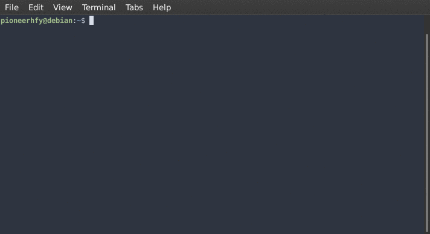
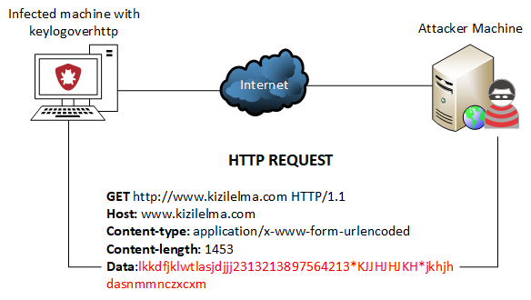
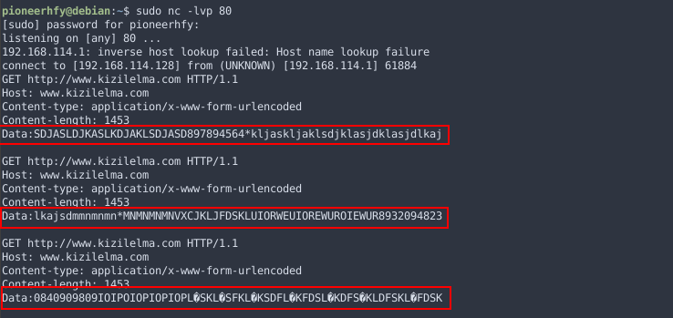

# Keylogoverhttp
Different keylogger that uses HTTP Request to exilftrate keystrokes from the victim machine.

## What is Keylogger?
Whether it is called a keylogger, spyware or monitoring software, it can be the equivalent of digital surveillance, revealing every click and touch, every download and conversation.

A keylogger (short for keystroke logger) is software that tracks or logs the keys struck on your keyboard, typically in a covert manner so that you don’t know that your actions are being monitored. This is usually done with malicious intent to collect your account information, credit card numbers, user names, passwords, and other private data.

Legitimate uses do exist for keyloggers. Parents can monitor their children’s online activity or law enforcement may use it to analyze and track incidents linked to the use of personal computers, and employers can make sure their employees are working instead of surfing the web all day.

Nevertheless, keyloggers can pose a serious threat to users, as they can be used to intercept passwords and other confidential information entered via the keyboard. As a result, cybercriminals can get PIN codes and account numbers for your financial accounts, passwords to your email and social networking accounts and then use this information to take your money, steal your identity and possibly extort information and money from your friends and family.

## Features

- Pure C with Win32 API Calls
- Registery editing for persistence
- Crafting HTTP Request for data exfiltrate
- Low detection rate (3/71) in virustotal
- Lower case keystroke detecting.

## Installing

> Please compile this program with Visual Studio C++ development tools. I recommend you to use Visual Studio for compiling. Open `keylogoverhttp.sln` with visual studio then build from the upper menu.

## How it works?

## Examples

## Low Detection Rate

## Author
* **Hakan İlbiz**

## License

This project is licensed under the GNU GPL v3.0 License - see the [LICENSE](./LICENSE) file for details

